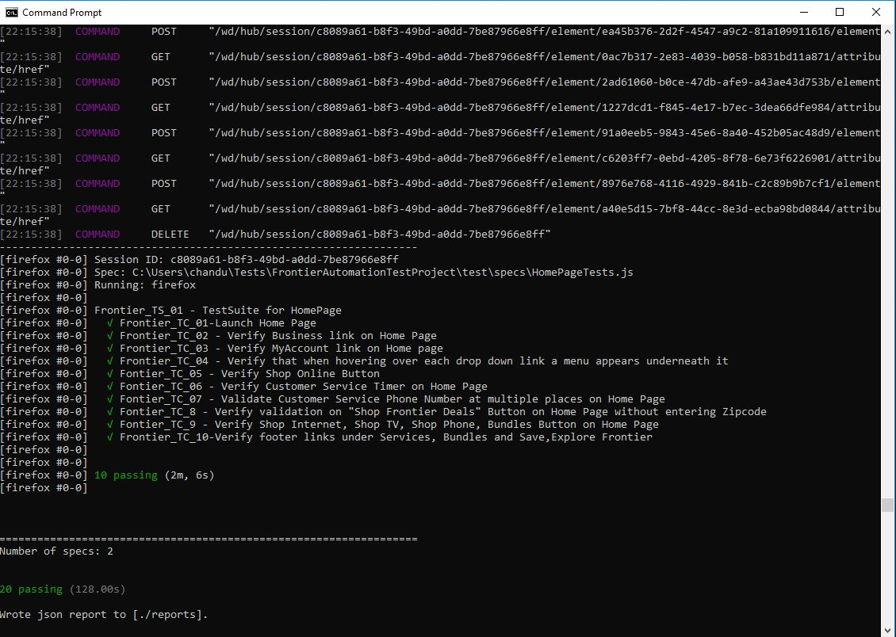
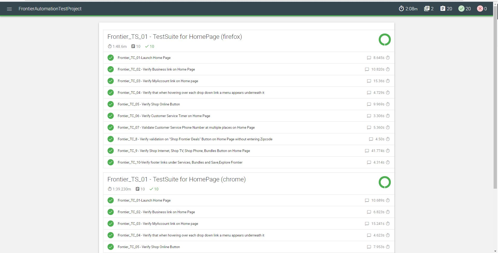

Installation and run instructions

#1. Frontier automation test suite needs following frameworks to be installed

         a. Selenium-standalone service

                i. Use the following command to install and save selenium-standalone service to local

                        npm install selenium-standalone --save-dev

                ii. Add the installation directory bin to path variable to start selenium standalone from any location

                iii. Run the following command to install the selenium-standalone components

	                selenium-standalone install

        b. Webdriverio
  
                 i. Use the following command to install webdriveio and save to local

          		npm install webdriverio --save-dev

                ii. Add the installation directory bin to path variable to use wdio command in start script (package.json)

          c. This automation test suite also uses Mocha, Chai, Spec reported and  wdio mocha awesome report generator. 
             The packages are included in the code base, so no need to install them.

#2. Running Tests
        
        a. Download or clone the code to local directory

        b. Navigate to “FrontierAutomationTest” directory using Terminal or cmd line

        c. Run the following command to run tests

  	          npm test
		  
 

        d. Run the following command to generate html report @ FrontierAutomationTestProject/mochawesome-report.html
   	
                npm generateReport
	  

